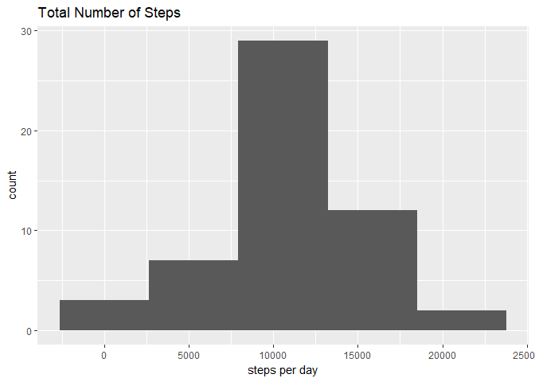
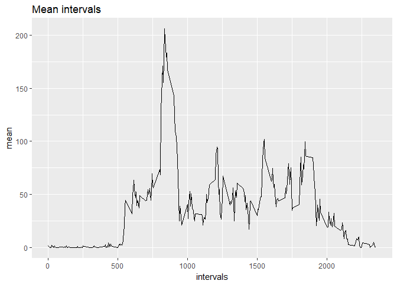
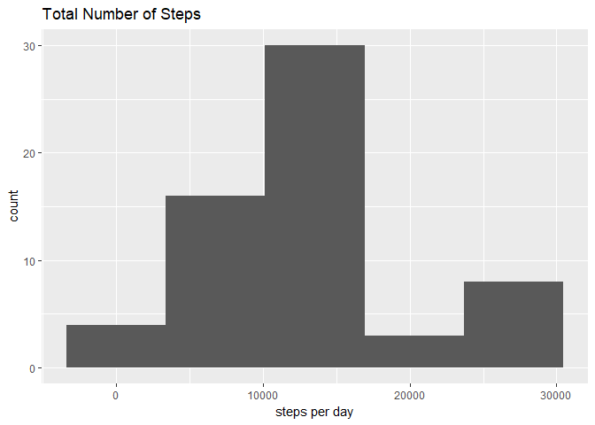

# Reproducible Research: Peer Assessment 1


```r
library(dplyr)
```

```
## Warning: package 'dplyr' was built under R version 3.3.3
```

```
## 
## Attaching package: 'dplyr'
```

```
## The following objects are masked from 'package:stats':
## 
##     filter, lag
```

```
## The following objects are masked from 'package:base':
## 
##     intersect, setdiff, setequal, union
```

```r
library(ggplot2)
```

```
## Warning: package 'ggplot2' was built under R version 3.3.3
```

```r
library(bnstruct)
```

```
## Warning: package 'bnstruct' was built under R version 3.3.3
```

```
## Loading required package: bitops
```

```
## Loading required package: Matrix
```

```
## Loading required package: igraph
```

```
## Warning: package 'igraph' was built under R version 3.3.3
```

```
## 
## Attaching package: 'igraph'
```

```
## The following objects are masked from 'package:dplyr':
## 
##     as_data_frame, groups, union
```

```
## The following objects are masked from 'package:stats':
## 
##     decompose, spectrum
```

```
## The following object is masked from 'package:base':
## 
##     union
```

```r
library(chron)
```

```
## Warning: package 'chron' was built under R version 3.3.3
```

```r
library(readr)
```

```
## Warning: package 'readr' was built under R version 3.3.3
```

```r
set.seed(123)
```

## Loading and preprocessing the data


```r
activity <- read_csv("activity.zip", col_types = cols(date = col_date(format = "%Y-%m-%d"),steps = col_integer()), na = "NA")
```

## What is mean total number of steps taken per day?

```r
sum.per.day <- activity %>% group_by(date) %>% summarise(sum = sum(steps))
print(sum.per.day)
```

```
## # A tibble: 61 x 2
##          date   sum
##        <date> <int>
##  1 2012-10-01    NA
##  2 2012-10-02   126
##  3 2012-10-03 11352
##  4 2012-10-04 12116
##  5 2012-10-05 13294
##  6 2012-10-06 15420
##  7 2012-10-07 11015
##  8 2012-10-08    NA
##  9 2012-10-09 12811
## 10 2012-10-10  9900
## # ... with 51 more rows
```


```r
qplot(sum.per.day$sum, geom = "histogram", bins=5, main = "Total Number of Steps", xlab = 'steps per day')
```

```
## Warning: Removed 8 rows containing non-finite values (stat_bin).
```

<!-- -->


```r
mean.per.day <- activity %>% group_by(date) %>% summarise(mean = mean(steps,na.rm=T))
```

```
## Warning: package 'bindrcpp' was built under R version 3.3.3
```

```r
print(mean.per.day)
```

```
## # A tibble: 61 x 2
##          date     mean
##        <date>    <dbl>
##  1 2012-10-01      NaN
##  2 2012-10-02  0.43750
##  3 2012-10-03 39.41667
##  4 2012-10-04 42.06944
##  5 2012-10-05 46.15972
##  6 2012-10-06 53.54167
##  7 2012-10-07 38.24653
##  8 2012-10-08      NaN
##  9 2012-10-09 44.48264
## 10 2012-10-10 34.37500
## # ... with 51 more rows
```


```r
median.per.day <- activity %>% group_by(date) %>% summarise(median.per.day = median(steps,na.rm=T))
print(median.per.day)
```

```
## # A tibble: 61 x 2
##          date median.per.day
##        <date>          <dbl>
##  1 2012-10-01             NA
##  2 2012-10-02              0
##  3 2012-10-03              0
##  4 2012-10-04              0
##  5 2012-10-05              0
##  6 2012-10-06              0
##  7 2012-10-07              0
##  8 2012-10-08             NA
##  9 2012-10-09              0
## 10 2012-10-10              0
## # ... with 51 more rows
```


## What is the average daily activity pattern?


```r
mean.intervals = activity %>% group_by(interval) %>% summarise(mean = mean(steps,na.rm=T))
print(mean.intervals)
```

```
## # A tibble: 288 x 2
##    interval      mean
##       <int>     <dbl>
##  1        0 1.7169811
##  2        5 0.3396226
##  3       10 0.1320755
##  4       15 0.1509434
##  5       20 0.0754717
##  6       25 2.0943396
##  7       30 0.5283019
##  8       35 0.8679245
##  9       40 0.0000000
## 10       45 1.4716981
## # ... with 278 more rows
```


```r
qplot(x = mean.intervals$interval, y = mean.intervals$mean, geom = 'line', xlab = 'intervals',ylab = 'mean', main = 'Mean intervals')
```

<!-- -->


```r
max.average.interval = which.max(mean.intervals$mean)
```

The max average interval is the 104th


```r
intervalo <- mean.intervals[max.average.interval,]
```

Interval: 835
Mean: 206.1698113


## Imputing missing values

 1. Calculate and report the total number of missing values in the dataset (i.e. the total number of rows with NAs)
 2. Devise a strategy for filling in all of the missing values in the dataset. The strategy does not need to be sophisticated. For example, you could use the mean/median for that day, or the mean for that 5-minute interval, etc.
 3. Create a new dataset that is equal to the original dataset but with the missing data filled in.
 4. Make a histogram of the total number of steps taken each day and Calculate and report the mean and median total number of steps taken per day. Do these values differ from the estimates from the first part of the assignment? What is the impact of imputing missing data on the estimates of the total daily number of steps?
 


```r
  number.nas = sum(is.na(activity$steps))
```
Number of NAS: 2304 

The strategy for filling in all of the missing values is filled up with the mean value with a random number based on the standard deviation  

```r
NA2value <- function(x){
  replace(x, is.na(x),mean(x, na.rm = T)+runif(sum(is.na(x)))*sd(x, na.rm = T))
}
activity.pre <- do.call(cbind,lapply(activity,NA2value))
activity.cl <- as.data.frame(activity.pre)
```


```r
sum.per.day <- activity.cl %>% group_by(date) %>% summarise(sum = sum(steps))
print(sum.per.day)
```

```
## # A tibble: 61 x 2
##     date      sum
##    <dbl>    <dbl>
##  1 15614 26921.92
##  2 15615   126.00
##  3 15616 11352.00
##  4 15617 12116.00
##  5 15618 13294.00
##  6 15619 15420.00
##  7 15620 11015.00
##  8 15621 26774.82
##  9 15622 12811.00
## 10 15623  9900.00
## # ... with 51 more rows
```


```r
qplot(sum.per.day$sum, geom = "histogram", bins=5, main = "Total Number of Steps", xlab = 'steps per day')
```

<!-- -->


```r
mean.per.day <- activity.cl %>% group_by(date) %>% summarise(mean = mean(steps,na.rm=T))
print(mean.per.day)
```

```
## # A tibble: 61 x 2
##     date     mean
##    <dbl>    <dbl>
##  1 15614 93.47890
##  2 15615  0.43750
##  3 15616 39.41667
##  4 15617 42.06944
##  5 15618 46.15972
##  6 15619 53.54167
##  7 15620 38.24653
##  8 15621 92.96811
##  9 15622 44.48264
## 10 15623 34.37500
## # ... with 51 more rows
```


```r
median.per.day <- activity.cl %>% group_by(date) %>% summarise(median.per.day = median(steps,na.rm=T))
print(median.per.day)
```

```
## # A tibble: 61 x 2
##     date median.per.day
##    <dbl>          <dbl>
##  1 15614       91.09203
##  2 15615        0.00000
##  3 15616        0.00000
##  4 15617        0.00000
##  5 15618        0.00000
##  6 15619        0.00000
##  7 15620        0.00000
##  8 15621       91.36884
##  9 15622        0.00000
## 10 15623        0.00000
## # ... with 51 more rows
```


## Are there differences in activity patterns between weekdays and weekends?

For this part the weekdays() function may be of some help here. Use the dataset with the filled-in missing values for this part.

 1. Create a new factor variable in the dataset with two levels – “weekday” and “weekend” indicating whether a given date is a weekday or weekend day.
 2. Make a panel plot containing a time series plot (i.e. type = "l") of the 5-minute interval (x-axis) and the average number of steps taken, averaged across all weekday days or weekend days (y-axis). See the README file in the GitHub repository to see an example of what this plot should look like using simulated data.

 

```r
activity.cl$weekday = as.factor(ifelse(is.weekend(activity.cl$date),'Weekend','Weekday'))
mean.cl = activity.cl %>% group_by(interval,weekday) %>% summarise(mean = mean(steps))
print(mean.cl)
```

```
## # A tibble: 576 x 3
## # Groups:   interval [?]
##    interval weekday      mean
##       <dbl>  <fctr>     <dbl>
##  1        0 Weekday 13.710514
##  2        0 Weekend 10.039565
##  3        5 Weekday 12.441164
##  4        5 Weekend 10.857648
##  5       10 Weekday 12.915704
##  6       10 Weekend  6.067604
##  7       15 Weekday 10.876534
##  8       15 Weekend  8.960947
##  9       20 Weekday 12.504026
## 10       20 Weekend 13.402814
## # ... with 566 more rows
```

```r
ggplot(data = mean.cl, aes(x = interval, y = mean)) + geom_line() + facet_grid(mean.cl$weekday~.)
```

<!-- -->


